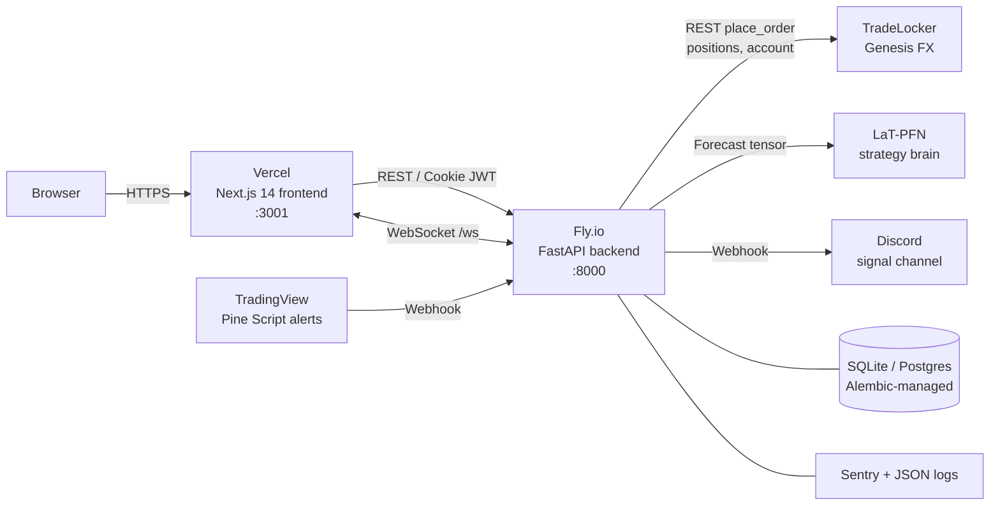

# Trade Copilot

> Donation-supported auto-trading platform — TradeLocker execution, LaT-PFN ML forecasts, hard safety guardrails.

[](#)
[](#)
[](#)
[](#)
[](#license)

**Production:** [trading.jetlag-recovery.com](https://trading.jetlag-recovery.com)

---

## What it is

Trade Copilot is a donation-supported, open-source-style auto-trading platform that connects to TradeLocker-backed brokers (Genesis FX) and executes signals from a small marketplace of strategy bots. It ships with a LaT-PFN zero-shot forecasting brain for momentum bots and a hand-tuned suite of classical strategies (ORB, Squeeze, Stoch Hook). Safety is non-negotiable: every trade flows through a kill switch, broker-truth position cap, consecutive-loss circuit breaker, and TOTP-protected admin actions. Users tip via Buy Me a Coffee — no subscriptions, no claims of returns, no custody of funds.

---

## Quickstart (60 seconds)

```bash
# Backend
cd backend && python -m venv venv && source venv/bin/activate
pip install -r requirements.txt
uvicorn app.main:app --reload
# -> http://localhost:8000  (docs at /docs)

# Frontend (separate terminal)
cd frontend && npm install && npm run dev
# -> http://localhost:3001
```

Copy `backend/.env.example` to `backend/.env` and fill in TradeLocker credentials before you connect a live account. The dashboard runs read-only without one.

---

## Architecture



The backend (`backend/app/main.py`) is the single source of truth: it owns auth, MFA, the bot registry, the strategy runners, the TradeLocker adapter, and the WebSocket fanout. The frontend is a thin Next.js shell — the strategy console at `frontend/app/strategy/page.tsx` opens a WebSocket and streams live PnL, position, and broker-state updates as they happen.

---

## Key features

| Category | Feature | Where it lives |
|---|---|---|
| Safety | Global panic switch (one DB flag halts every bot) | `app/core/kill_switch.py` |
| Safety | Broker-truth position cap (uses live broker count, not DB cohorts) | ADR-0007 |
| Safety | Circuit breaker — auto-halt after N consecutive losses | `app/core/circuit_breaker.py` |
| Safety | TOTP MFA on admin + sensitive routes | `app/api/mfa.py` |
| Safety | Idempotent `client_order_id` on every `place_order` | TradeLocker adapter |
| Safety | SL/TP verify + repair after fill | TradeLocker adapter |
| Execution | Partial close at +0.5R, break-even SL at +0.3R | Strategy runners |
| Execution | Hedging-mode partial close support | ADR-0009 |
| Execution | Per-instrument PnL scaler (crypto vs FX) | ADR-0008 |
| Forecasting | LaT-PFN zero-shot ML brain for momentum bot | ADR-0005 |
| Forecasting | Synthetic-bar detection — refuses to trade on fabricated data | `app/strategies/bar_fetcher.py` |
| Auth | Cookie-based JWT auth + refresh | ADR-0004 |
| Ops | Latency tracking (decision -> broker fill) | `app/monitoring/` |
| Ops | Auto-resume runners on machine restart | StrategyRunner registry |
| Ops | Alembic migrations + staging Fly app | `docs/MIGRATIONS.md`, `docs/STAGING.md` |
| Ops | Structured JSON logs + Sentry | `app/core/logging.py` |

---

## Operating runbook

| Task | One-liner | Reference |
|---|---|---|
| Deploy backend | `fly deploy --config fly.toml` | [docs/STAGING.md](docs/STAGING.md) |
| Add a DB column | `alembic revision --autogenerate -m "add foo"` | [docs/MIGRATIONS.md](docs/MIGRATIONS.md) |
| Run tests | `cd backend && pytest` | [docs/SETUP.md](docs/SETUP.md) |
| Run frontend tests | `cd frontend && npm test` | — |
| Review API surface | open `http://localhost:8000/docs` | [docs/API.md](docs/API.md) |
| WebSocket protocol | — | [docs/WS_PROTOCOL.md](docs/WS_PROTOCOL.md) |
| Architecture deep-dive | — | [docs/ARCHITECTURE.md](docs/ARCHITECTURE.md) |
| Risk + threat model | — | [docs/RISK.md](docs/RISK.md), [docs/RISK_MATRIX.md](docs/RISK_MATRIX.md) |
| Architecture decisions | — | [docs/adr/](docs/adr/) |
| Legal / disclaimer | — | [LEGAL.md](LEGAL.md) |

> **Note.** A consolidated `docs/THREAT_MODEL.md` and `docs/CONTRIBUTING.md` are tracked under todo #105 and will land alongside the pre-commit-hooks PR. Until then, use `docs/RISK.md` + `docs/RISK_MATRIX.md` for threat content.

### Key ADRs

- [0001 — FastAPI backend](docs/adr/0001-fastapi-backend.md)
- [0002 — TradeLocker REST, not MT5](docs/adr/0002-tradelocker-rest-not-mt5.md)
- [0003 — Donation, not subscription billing](docs/adr/0003-donation-not-subscription-billing.md)
- [0004 — JWT cookie auth](docs/adr/0004-jwt-cookie-auth.md)
- [0005 — LaT-PFN as strategy brain](docs/adr/0005-latpfn-as-strategy-brain.md)
- [0006 — Genesis FX broker choice](docs/adr/0006-genesis-fx-broker-choice.md)
- [0007 — Broker-truth position cap](docs/adr/0007-broker-truth-position-cap.md)
- [0008 — Instrument PnL scaler](docs/adr/0008-instrument-pnl-scaler.md)
- [0009 — Hedging-mode partial close](docs/adr/0009-hedging-mode-partial-close.md)

---

## Status

**SDLC score: 93 / 100 — Production-Ready**

Self-assessed against the CLAUDE.md SDLC framework, DORA (deployment frequency, lead time, MTTR, change-fail rate — qualitative for now, no telemetry yet), OWASP ASVS Level 2 (per-control verdict table in [`docs/SECURITY_ASVS.md`](docs/SECURITY_ASVS.md)), the Twelve-Factor App methodology, and a trading-specific benchmark covering kill-switch coverage, broker-truth reconciliation, idempotency, and ML-forecast guardrails.

| Phase | Score | Notes |
|---|---:|---|
| Requirements | 95 | 18 FRs · 10 NFRs · 15 user stories · STAKEHOLDERS.md sign-off matrix · REQUIREMENTS_TRACEABILITY.md |
| Design / Architecture | 96 | C4 diagrams · 9 ADRs · STRIDE THREAT_MODEL · WCAG 2.1 AA audit · WS_PROTOCOL · STRATEGIES |
| Development | 92 | 461 backend tests · MFA TOTP · audit log · circuit breakers · idempotent orders · HMAC webhooks · JWT cookie auth |
| Testing & QA | 92 | 461 pytest + 74 vitest + 10 Playwright · property-based + perf-SLA + concurrency · CI coverage gate 73% |
| Deployment | 95 | 7-job CI · Fly prod + staging · auto-deploy on `staging` branch · staging-smoke gate · Alembic w/ auto-upgrade · pre-commit hooks |
| Monitoring | 88 | /health + /health/detail (DB + broker probes) · /metrics (Prometheus) · structured JSON · request-ID middleware · Sentry · reconciliation · daily-summary |

Closed since the previous scorecard (2026-05-08 → 2026-05-11): per-user instrument selector + filter, 7/7 CI green pipeline including staging-smoke prod gate, MFA, audit log, lockout, daily summary, panic switch, reconciliation, CORS regex covering all `*.jetlag-recovery.com`, alert-cooldown bug, 3 stale Playwright specs repaired, Dependabot + CODEOWNERS + PR template.

Remaining open items: external uptime SaaS (BetterUptime), log aggregation (Axiom/Logtail), mutation testing (mutmut), Locust load suite, DORA telemetry dashboard, post-subscribe instrument-filter edit UI.

---

## Tech stack

- **Backend** — FastAPI, SQLAlchemy, Alembic, slowapi, python-jose, pyotp, Sentry
- **Frontend** — Next.js 14 (App Router), TypeScript, Tailwind, terminal/TUI theme
- **Data** — SQLite (dev) / Postgres (prod), structured JSON logging
- **Broker** — Genesis FX via TradeLocker REST
- **ML** — LaT-PFN zero-shot forecaster (CPU PyTorch)
- **Signals** — TradingView Pine Script webhooks
- **Hosting** — Fly.io (backend), Vercel (frontend)
- **Donations** — Buy Me a Coffee ([buymeacoffee.com/dbutler](https://buymeacoffee.com/dbutler))

---

## Legal

This software is provided for **educational purposes only**. It is not financial advice and makes no claim of returns. Donations via Buy Me a Coffee are gratuities, not payment for trading services. Users execute trades against their own broker accounts, at their own risk. Full disclaimer in [LEGAL.md](LEGAL.md).

---

## License

License: **TBD** (will be added with the next release). Until a `LICENSE` file lands, treat this repo as source-available for evaluation — no redistribution or commercial reuse.

---

*Built by [@moltbot47](https://github.com/moltbot47). Tips welcome at [buymeacoffee.com/dbutler](https://buymeacoffee.com/dbutler).*
