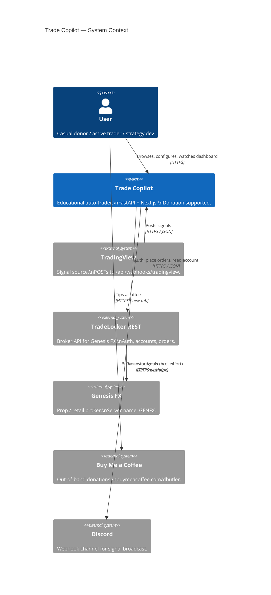
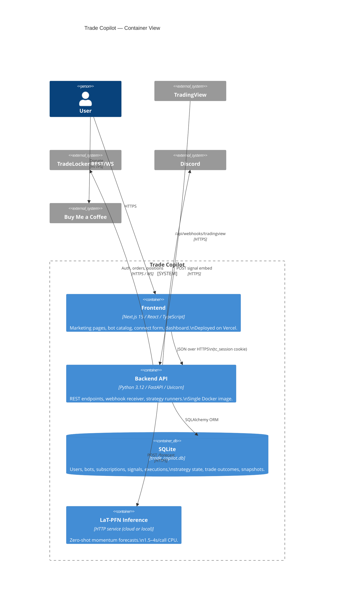

# Trade Copilot — Architecture

This document describes the runtime architecture of Trade Copilot v0.1 using the C4 model (Context → Container → Component). Every diagram is rendered as a Mermaid block so it stays version-controlled alongside the code. The design optimizes for an MVP's two highest-value attributes: low operational cost (one Docker image, one SQLite file) and a tight feedback loop from signal arrival to chart rendering.

---

## Level 1 — System Context

Trade Copilot sits between the user, their broker (TradeLocker / Genesis FX), the signal source (TradingView), and a few non-custody peripherals (Discord for alerts, Buy Me a Coffee for donations). The trust boundary that matters most: **broker credentials and access tokens never leave Trade Copilot's encrypted storage in plaintext, and the user's funds remain in their own brokerage account at all times.**

Data flows: TradingView posts signals → Trade Copilot fans out → TradeLocker executes → Trade Copilot polls TradeLocker for state → user's browser polls Trade Copilot for the dashboard. Donations bypass the system entirely (the user clicks a BMC link).

**Trust boundaries**
- The HTTPS edge between the user's browser and Trade Copilot — protected by HttpOnly + SameSite=Lax cookies and CORS allow-list (`ALLOWED_ORIGINS`).
- The TradeLocker boundary — protected by Fernet-encrypted tokens at rest, server-side only.
- The Discord and BMC edges are best-effort, low-trust — failure must never affect the core signal pipeline.

---

## Level 2 — Container

Inside Trade Copilot there are two deployable units (FastAPI backend, Next.js frontend) plus three logical stores (SQLite, an outbound LaT-PFN inference HTTP service, the Fernet-encrypted credential store inside SQLite). The frontend is purely a presentation layer and never holds secrets — it talks to the backend over HTTPS with the session cookie.

**Why these boundaries**
- Frontend / backend split keeps secrets server-side and lets the marketing site cache aggressively on Vercel's edge.
- Inline LaT-PFN (vs. a separate container in v0.1) is acceptable because the model is already abstracted behind `app/strategies/latpfn_client.py` — promoting it to a sidecar container is a one-line config change later.
- SQLite is a bet on operational simplicity. The schema is already SQLAlchemy-clean, so the swap to PostgreSQL is purely a `DATABASE_URL` change plus an Alembic migration script.

---

## Level 3 — Component (inside the FastAPI backend)

The backend decomposes into nine cohesive components. The router layer (`app/api/*`) is intentionally thin — it parses requests, calls into the core or strategy layers, and serializes the result. All shared concerns (encryption, JWT, rate-limit, broker client, signal routing) live in `app/core/*`. The strategy runner has its own subtree (`app/strategies/*`) because it is the only stateful, long-lived component.

```mermaid
C4Component
    title Trade Copilot — Backend Components

    Container_Boundary(api, "FastAPI Backend") {
        Component(auth, "Auth Router", "app/api/auth.py", "POST /login, /logout, GET /me.\nIssues HS256 JWT in tc_session cookie.")
        Component(users, "Users Router", "app/api/users.py", "POST /users, GET /users/me.\nHosts get_current_user dep.")
        Component(bots, "Bots Router", "app/api/bots.py", "Public catalog: GET /bots, /bots/{id}.")
        Component(subs, "Subscriptions Router", "app/api/subscriptions.py", "User-scoped CRUD over Subscription.")
        Component(tlrouter, "TradeLocker Router", "app/api/tradelocker.py", "/connect, /account.\nPersists encrypted tokens.")
        Component(dash, "Dashboard Router", "app/api/dashboard.py", "/pnl, /positions.")
        Component(stratapi, "Strategy Router", "app/strategies/api.py", "/strategy/start, /stop, /status, /equity.")
        Component(calc, "Calculator Router", "app/api/calculator.py", "/calculator/generate, /preview.")
        Component(hooks, "Webhooks Router", "app/api/webhooks.py", "/webhooks/tradingview.")

        Component(jwt, "JWT helper", "app/core/jwt.py", "issue_session_token, verify_session_token.")
        Component(crypto, "Crypto", "app/core/crypto.py", "Fernet encrypt/decrypt for broker creds.")
        Component(rl, "Rate Limit", "app/core/rate_limit.py", "slowapi limiter; 10/min on /auth/login.")
        Component(risk, "Risk Engine", "app/core/risk_engine.py", "Enforces max_daily_loss_pct.")
        Component(router, "Signal Router", "app/core/signal_router.py", "Fan-out: signal → executions per subscriber.")
        Component(tlclient, "TradeLockerClient", "app/core/tradelocker_client.py", "Auth, place_order, get_account_state, get_positions.")
        Component(disc, "Discord Notifier", "app/core/discord_notifier.py", "Best-effort embed POST.")
        Component(pdf, "Compound PDF", "app/core/compound_pdf.py", "ReportLab-backed PDF generator.")

        Component(runner, "Strategy Runner", "app/strategies/runner.py", "Asyncio loop per (bot_id, timeframe).\nManages StrategyState lifecycle.")
        Component(feed, "Data Feed", "app/strategies/data_feed.py", "Fetches OHLCV bars for runner.")
        Component(latcli, "LaT-PFN Client", "app/strategies/latpfn_client.py", "HTTPS adapter for forecast service.")
        Component(perf, "Performance Tracker", "app/strategies/performance_tracker.py", "Rolling 20-trade snapshot.")
        Component(fb, "Feedback Adjuster", "app/strategies/feedback.py", "tighten/loosen/pause/hold.")
        Component(posmon, "Position Monitor", "app/strategies/position_monitor.py", "Tracks open trades; writes TradeOutcome on close.")
    }

    ContainerDb(db, "SQLite")
    System_Ext(tl, "TradeLocker")
    System_Ext(latpfn, "LaT-PFN Service")
    System_Ext(disc_ext, "Discord")

    Rel(auth, jwt, "uses")
    Rel(users, jwt, "uses")
    Rel(auth, rl, "decorates")
    Rel(tlrouter, crypto, "uses")
    Rel(tlrouter, tlclient, "uses")
    Rel(dash, tlclient, "uses")
    Rel(hooks, router, "fan_out()")
    Rel(hooks, disc, "post_signal_to_discord()")
    Rel(router, risk, "checks")
    Rel(router, tlclient, "place_order")
    Rel(stratapi, runner, "start/stop/status")
    Rel(runner, feed, "polls")
    Rel(runner, latcli, "forecast")
    Rel(runner, posmon, "tracks")
    Rel(posmon, perf, "trade closed")
    Rel(perf, fb, "snapshot")
    Rel(fb, db, "updates StrategyState.threshold")
    Rel(disc, disc_ext, "HTTPS")
    Rel(tlclient, tl, "HTTPS")
    Rel(latcli, latpfn, "HTTPS")
    Rel(calc, pdf, "uses")
```

**Component-level decisions**
- The router layer never imports from the strategies layer except through `app/strategies/api.py` — keeping the API surface auditable.
- `get_current_user` in `app/api/users.py` is the single identity entry point; every protected route depends on it.
- The signal router is the only place that touches both the risk engine and the broker client — concentrating the "place a real order" decision in one file is deliberate (NFR-6 auditability).
- The strategy runner subtree is async-first (`asyncio.create_task`); the rest of the API is synchronous SQLAlchemy. The runner uses its own `SessionLocal` so request-scoped sessions don't leak.

---

## Quality Attributes & Tradeoffs

| # | Attribute | How the architecture addresses it | Tradeoff accepted |
|---|-----------|-----------------------------------|-------------------|
| 1 | **Operational simplicity** | One Docker image, one SQLite file, one Vercel deploy. | Vertical scaling ceiling around 50–100 users; PostgreSQL migration required beyond that (C-3). |
| 2 | **Security at rest** | Fernet (AES-128-CBC + HMAC) for broker creds; HttpOnly + SameSite=Lax JWT cookies; production-boot guard refuses placeholder keys. | Single `ENCRYPTION_KEY` rotation requires a migration script (ADR followup). |
| 3 | **Auditability** | Every order placement writes an `Execution` row with `user_id`, `signal_id`, status, timestamps. `TradeOutcome` closes the loop with realized PnL. | Full audit at the cost of permanent storage growth — addressed by retention policy (NFR-10). |
| 4 | **Graceful degradation** | TradeLocker outage → `connected: true` with null financials, not a 5xx. Discord/BMC failures swallowed. `/health` is dependency-free. | The user temporarily sees stale account state; mitigated by the dashboard's "last updated" timestamp. |
| 5 | **Latency** | Synchronous routes are lightweight; the heavy work (LaT-PFN, broker calls) is in async tasks. Read endpoints touch SQLite only. | Cannot scale past one Uvicorn worker without sticky sessions for the runner; v0.2 introduces a separate runner process. |
| 6 | **Testability** | Thin routers + pure helpers + dependency-injected `get_db` makes 90%+ of code unit-testable without a real broker. | Integration tests require either a mock TradeLocker or a recorded fixture file (`tradelocker_config.json`). |
| 7 | **Deployability** | GitHub Actions builds the Docker image; Vercel auto-deploys the frontend on every push to main. | Coupled releases — backend and frontend versions move together. Acceptable for an MVP. |
| 8 | **Compliance posture** | Donation-only revenue, no managed accounts, no advice copy, mandatory `LEGAL.md`. | Cannot grow ARPU above what donations yield; conscious choice (ADR-0003). |

---

## Cross-References

- `REQUIREMENTS.md` — the FR/NFR list these components serve.
- `adr/0001-fastapi-backend.md` — why FastAPI.
- `adr/0002-tradelocker-rest-not-mt5.md` — why REST + WS.
- `adr/0003-donation-not-subscription-billing.md` — why no Stripe.
- `adr/0004-jwt-cookie-auth.md` — why HttpOnly cookies.
- `adr/0005-latpfn-as-strategy-brain.md` — why LaT-PFN.
- `adr/0006-genesis-fx-broker-choice.md` — why Genesis FX as the demo broker.
- `API.md` — endpoint-level contracts.
- `RISK_MATRIX.md` — risks against each quality attribute.
